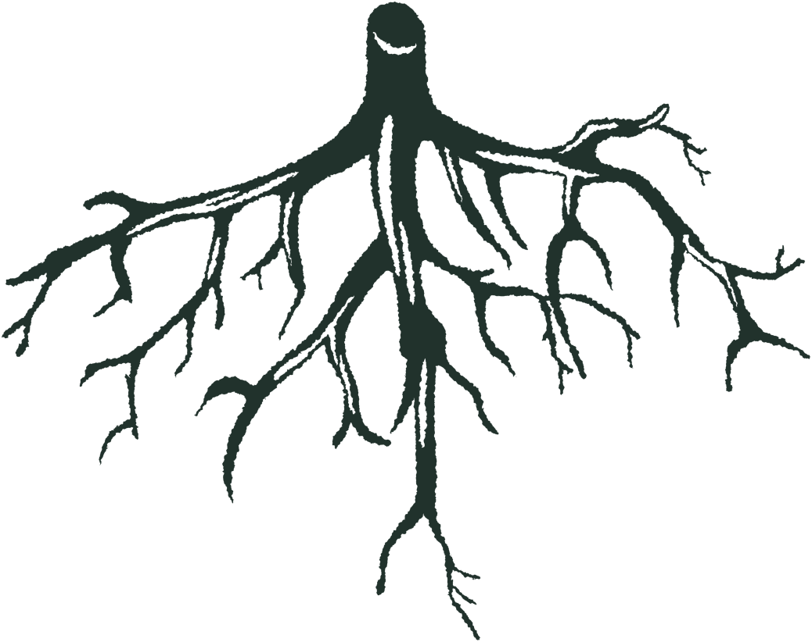
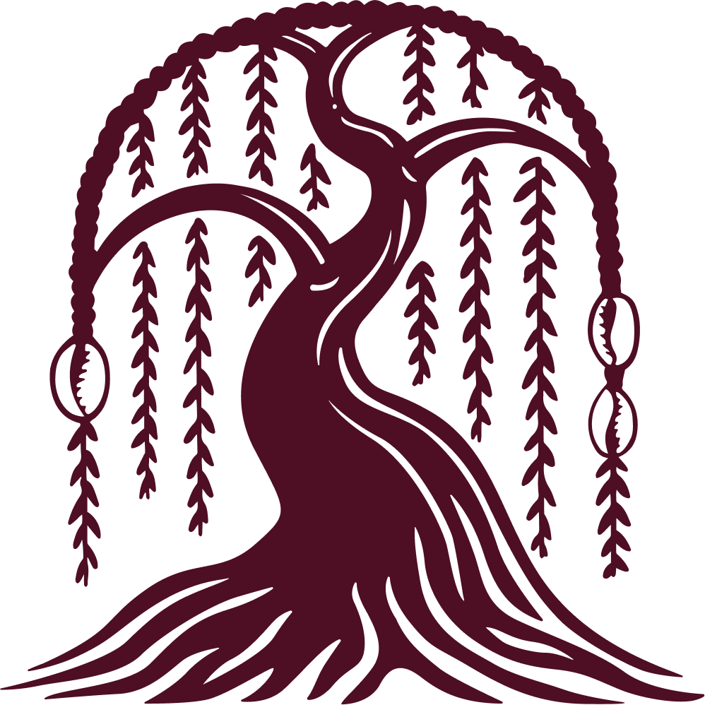

# Plan de ejecución — Feedback R3 · Rested Root Website

Documento de trabajo para el modelo/implementador que aplicará los cambios. Mapeo exacto feedback → archivo → línea → cambio, con nombres de archivo reales ya presentes en el proyecto, más notas de riesgo y checklist de verificación.

Actualizado: 2026-07-16 · **Assets de marca ya integrados en el proyecto.**

---

## 0. Estado de los assets — RESUELTO ✅

Los brand assets ya están copiados dentro del proyecto:

- **`images/brand/`** — 69 archivos: logos (primary, secondary, logomark, logotype) en todas las colorways (PNG + SVG) e ilustraciones (acorn, branch, leaves, roots, seed) en 6 colorways cada una.
- **`fonts/`** — `VTCMarsha-Bold.woff2`, `.woff`, `.otf` (la fuente correcta que pidió la clienta).

Fuente original: `Downloads/Archivos rested root/Brand Assets/`.

### Anatomía del sistema de logos (importante para elegir bien)

| Tipo | Qué es | Uso recomendado |
|---|---|---|
| **Primary logo** | Árbol (sauce) **encima** del texto "RESTED ROOT" (lockup vertical, ~cuadrado) | Footer, tarjetas, usos centrados |
| **Secondary logo** | Árbol **al lado** del texto "RESTED ROOT" (lockup horizontal) | **Nav bar** (ancho y bajo) |
| **Logomark** | Solo el símbolo del árbol (sin texto) | Favicon, sello, página About |
| **Logotype** | Solo la palabra "RESTED ROOT" (sin árbol) | Usos secundarios |

Colorways disponibles por logo: `black, burgundy, cream, forest, honey, moss` (+ combinadas `terra-moss`, `burgundy-moss`, etc.).

### Notas sobre las fuentes

- ⚠️ **VTC Marsha solo trae peso Bold.** No hay Regular/Light. El `@font-face` debe cargar los archivos `-Bold` y declararse como el único peso (400/normal) para que todos los titulares lo usen.
- 🎁 **Bonus disponible:** el pack también incluye las fuentes reales **Nacelle** (subtítulos h3/h4) y **Gowun Batang** (cuerpo), que hoy el CSS referencia pero cae a Montserrat/Georgia porque no había archivos. Se pueden auto-alojar para fidelidad total de marca (ver "Sugerencias adicionales"). Están en `Downloads/Archivos rested root/Brand Assets/Font Files/` — no las copié al proyecto todavía porque quedan fuera del feedback; avísame si las quieres integrar.
- Retirar `fonts/marsha.ttf` (era una demo "Marsha" de Trim Studio con licencia solo de uso personal — no es VTC Marsha).

### Paleta (definida en `css/style.css` `:root`)

`--forest #21322C` · `--moss #776E2C` · `--honey #F7CB60` · `--cream #F3F1E3` · `--burgundy #4E0E24` · `--terra #B9470E`

Estructura: sitio estático de 5 páginas (`index.html`, `about.html`, `services.html`, `tree.html`, `collaborate.html`), un único `css/style.css` y `js/script.js`. Header/footer están duplicados en cada HTML (no hay includes) → los cambios globales de logo se replican en las 5 páginas.

---

## Punto 1 — Actualizar el logo antiguo al nuevo (global)

Reemplazar `images/logo-color.png` (header/footer) y el favicon `images/logo-simple.png` por los nuevos assets. Ubicaciones:

| Archivo | Líneas (favicon / header / footer) |
|---|---|
| index.html | 16 / 24 / 316 |
| about.html | 16 / 24 / 145 |
| services.html | 16 / 24 / 149 |
| tree.html | 14 / 22 / 148 |
| collaborate.html | 14 / 22 / 143 |

Asignación recomendada (el header lo define el Punto 2):

- **Favicon:** `images/brand/rested-root_logomark_forest.png` (símbolo, se lee bien pequeño).
- **Footer:** fondo del footer = `--forest` (verde oscuro, CSS 1637-1640) → usar colorway clara: **`rested-root_primary-logo_cream.png`** (o `_honey`). El primary ya incluye el texto "RESTED ROOT", así que **eliminar el `<span class="site-footer__logo-text">Rested Root</span>`** redundante (index 317, about 146, services 150, tree, collaborate). Ajustar `.site-footer__logo-img` (CSS 1662-1668): el primary es casi cuadrado, subir `max-width` a ~120px.

Retirar assets legacy tras el cambio: `logo-color.png`, `logo-simple.png`, `logo-official.png`, `logo-green.png`.

---

## Punto 2 — Logo del nav = secondary logo honey

**Archivo:** `` del header en las 5 páginas (línea 24 en index/about/services; 22 en tree/collaborate).

```html

```

**Ajuste de CSS necesario:** el secondary es un lockup **horizontal** (ancho ≫ alto). El `.site-header__logo-img` actual está pensado para un logo pequeño. Fijar por altura y dejar el ancho automático, p. ej.:
```css
.site-header__logo-img { height: 44px; width: auto; max-width: 220px; object-fit: contain; }
```

⚠️ **Riesgo de contraste — decisión de diseño.** El header es transparente al inicio y pasa a sólido `--forest` al hacer scroll (`js/script.js` 12-17).
- Header sólido (forest) y `index.html` (hero oscuro) → honey se ve perfecto.
- En páginas `page-light` (about, services, tree, collaborate), arriba del todo el header transparente está sobre fondo **crema/blanco** → el logo **honey tendrá poco contraste**.

Opciones: (a) aceptarlo; (b) servir una colorway distinta (p. ej. `secondary-logo_forest` o `_burgundy`) cuando el header está transparente en páginas claras, y reservar el honey para el estado sólido / la home. Confirmar con la clienta. (Los honey files son los que ella pidió explícitamente, así que por defecto respetamos honey y solo lo marcamos como observación.)

---

## Punto 3 — Tipografía de titulares → VTC Marsha

**Archivo:** `css/style.css`.

1. Sustituir el `@font-face` (líneas 66-72):
```css
@font-face {
    font-family: 'VTCMarsha';
    src: url('../fonts/VTCMarsha-Bold.woff2') format('woff2'),
         url('../fonts/VTCMarsha-Bold.woff') format('woff');
    font-weight: 400;   /* único peso disponible; se declara como normal */
    font-style: normal;
    font-display: swap;
}
```
2. Actualizar las pilas de fuentes de titulares:
   - `.font-hero, .hero__title` (línea 79): `'VTCMarsha', 'Georgia', serif`
   - `.font-heading, h1, h2` (línea 90): `'VTCMarsha', 'Georgia', serif`
3. Overrides que aún usan **Abril Fatface** en titulares → cambiarlos a `'VTCMarsha'` para consistencia total: líneas **584, 1089, 1491**.
4. Retirar el `@import` de Abril Fatface (línea 74) cuando ya no se use.
5. Preload en el `<head>` de las 5 páginas para evitar parpadeo:
```html
<link rel="preload" href="fonts/VTCMarsha-Bold.woff2" as="font" type="font/woff2" crossorigin>
```

**Decisión a confirmar:** los `h3`/`h4` usan hoy sans (`Nacelle`/`Montserrat`, línea 101). Recomiendo mantenerlos en sans por jerarquía, salvo que la clienta quiera literalmente todos los encabezados en VTC Marsha.

---

## Punto 4 — "Our Cooperative" (home): raíces al ~¾ de la banda crema, con transparencia

**Archivo:** `index.html`, sección `.about-mission` "OUR COOPERATIVE" (líneas 64-82). CSS: `css/style.css` 1251-1287.

**Estado actual:** grid de 2 columnas; imagen `branch-acorn.png` (280px, opacity 0.55) en la derecha.

**Cambio:** que las **raíces** ocupen ~¾ del ancho de la banda crema como textura de fondo semitransparente. Usar **`images/brand/rested-root_roots_forest.png`** (raíces verde oscuro → sobre crema, a baja opacidad, dan textura sutil sin perder legibilidad).

```html
<section class="about-mission about-mission--home">
    
    <div class="container"> ... texto ... </div>
</section>
```
```css
.about-mission--home { position: relative; overflow: hidden; }
.about-mission__bg-roots {
    position: absolute; right: 0; top: 50%;
    transform: translateY(-50%);
    width: 75%; max-width: 900px;
    opacity: 0.15;              /* ajustar 0.12–0.22 */
    pointer-events: none; z-index: 0;
}
.about-mission--home .container { position: relative; z-index: 1; }
```
Quitar la imagen `branch-acorn.png` de la columna derecha. Verificar legibilidad del texto y ajustar opacidad tras ver el resultado.

---

## Punto 5 — "What We Offer" (home): cambiar dos imágenes

**Archivo:** `index.html`, `.services-preview` (líneas 152-173). Cada `.service-card` tiene fondo `--forest` (CSS 866-867), así que las ilustraciones deben ser **claras** (cream/honey).

- **Conflict Navigation** (línea 164): `images/trunk-icon.png` → `images/brand/rested-root_branch_cream.png`
- **Strategic Planning** (línea 169): `images/root-icon.png` → `images/brand/rested-root_leaves_cream.png`

⚠️ **Quitar la clase `service-card__img--invert`** de estas dos imágenes. Ese filtro (CSS 908-911: grayscale+invert+brightness+screen) está pensado para oscurecer iconos oscuros; sobre una ilustración cream la invertiría a oscuro y la haría ilegible.

💡 **Consistencia (recomendado):** las otras dos cards (Workshops=acorn, Team Building=sapling) siguen usando iconos webp viejos invertidos. Para que la fila combine, sugiero cambiar las cuatro a colorway cream del pack: `rested-root_acorn_cream.png` (Workshops) y `rested-root_seed_cream.png` (Team Building), quitando el invert en todas. Fuera del feedback estricto — confirmar con la clienta.

---

## Punto 6 — Misma edición en la página Services

**Archivo:** `services.html`. Los bloques `service-detail` tienen fondos alternos (`--forest`, `--cream`, `--burgundy`, `--honey`), así que hay que elegir colorway por fondo.

- **Conflict Navigation** (línea 90, fondo **burgundy**): `images/trunk-icon.png` → `images/brand/rested-root_branch_cream.png` (cream sobre burgundy = alto contraste).
- **Strategic Planning** (línea 106, fondo **honey**): `images/root-icon.png` → `images/brand/rested-root_leaves_forest.png` (forest sobre honey = legible; el cream sobre honey tendría poco contraste).

⚠️ **Duplicado a vigilar:** "Organizational Consulting" (línea 122) usa hoy `branch-illustration.png`. Tras poner branch en Conflict Navigation, aparecería branch dos veces en la página. Sugerencia: cambiar Organizational Consulting a otra ilustración (p. ej. `rested-root_roots_cream.png`, fondo forest) para variar. Confirmar con la clienta.

---

## Punto 7 — "Growing Liberation": texto no centrado sobre burgundy

**Archivo:** `index.html` (181-184) + `css/style.css` (`.tree-teaser__body` 989, `.tree-teaser__title` 983).

**Diagnóstico:** el contenedor `.tree-teaser__text` va centrado (inline `text-align:center; max-width:700px; margin:0 auto`), pero `.tree-teaser__body` tiene `max-width:500px` **sin márgenes horizontales auto**, así que su caja queda pegada a la izquierda y el texto se ve descentrado.

**Fix (CSS):**
```css
.tree-teaser__body {
    max-width: 500px;
    margin-left: auto;
    margin-right: auto;
    text-align: center;
}
```
(Opcional: `text-align:center` también en `.tree-teaser__title`.) Revisar en desktop y móvil.

---

## Punto 8 — Página "Our Cooperative": logo → logomark burgundy

**Archivo:** `about.html`, línea 68.

```html
<!-- antes: images/flower-purple-1.png -->

```
La sección tiene fondo `--cream` → el logomark burgundy contrasta bien. Ajustar `max-width` si hace falta (el logomark es cuadrado).

---

## Punto 9 — "What Grounds Us": ilustraciones → colorway cream

**Archivo:** `about.html`, `.about-values` (líneas 100-125). Fondo de sección: `--forest` (CSS 1290-1293) → usar colorway **cream** en todas.

| Línea | Actual | Nuevo (cream) |
|---|---|---|
| 102 (Vulnerable) | `acorn-icon.webp` | `images/brand/rested-root_acorn_cream.png` |
| 107 (Strategic) | `sapling-icon.webp` | `images/brand/rested-root_seed_cream.png` |
| 112 (Accountable) | `trunk-icon.png` | `images/brand/rested-root_branch_cream.png` |
| 117 (Liberatory) | `root-icon.png` | `images/brand/rested-root_roots_cream.png` |
| 122 (Embodied) | `flower-dark-purple.png` | `images/brand/rested-root_leaves_cream.png` |

(El pack no tiene "trunk" ni "flower"; mapeo por afinidad: trunk→branch, flower→leaves. Ajustable a gusto de la clienta.) Los `` ya traen `style="width:48px;height:48px;object-fit:contain;"` inline — mantener o subir un poco el tamaño si las ilustraciones lo piden.

---

## Sugerencias adicionales detectadas (fuera del feedback)

- **Auto-alojar Nacelle y Gowun Batang** (disponibles en el pack) para fidelidad de marca en subtítulos y cuerpo, en vez de los fallback Montserrat/Georgia actuales. Copiar los `.woff` a `fonts/` y añadir sus `@font-face`.
- **Año del copyright:** el footer dice `© 2025` en las 5 páginas — actualizar a 2026.
- **Enlaces sociales** LinkedIn/Instagram/Facebook son `href="#"` (placeholders).
- **Placeholders de contenido** en `services.html` (líneas 78, 94, 110, 126): "[The Rested Root team will provide their own description…]".
- **Logos legacy** a retirar tras el Punto 1: `logo-color.png`, `logo-simple.png`, `logo-official.png`, `logo-green.png`.

---

## Orden de ejecución recomendado

1. Punto 3 (VTC Marsha) — transversal, primero para ver titulares reales.
2. Puntos 1 y 2 (logos header/footer/favicon en las 5 páginas + ajustes CSS de tamaño).
3. Puntos 5 y 6 (swap de ilustraciones home + services, quitando `--invert`).
4. Puntos 4 y 7 (CSS: textura de raíces + centrado tree-teaser).
5. Puntos 8 y 9 (about: logomark burgundy + iconos cream).
6. Sugerencias adicionales aprobadas.

## Checklist de verificación

- [ ] VTC Marsha carga en todos los titulares (h1/h2 + títulos de sección); sin fallback visible a Georgia.
- [ ] Ningún HTML referencia ya `logo-color.png` / `logo-simple.png` / otros legacy.
- [ ] Nav: secondary-logo_honey bien dimensionado (no deformado, no diminuto) y con contraste aceptable en páginas claras (o decisión tomada).
- [ ] Footer: primary-logo claro visible sobre forest; span de texto duplicado eliminado.
- [ ] Home: raíces al ~¾ de la banda crema, texto legible sobre la textura.
- [ ] Conflict Navigation = branch y Strategic Planning = leaves, en home y services, con colorway adecuada al fondo y sin filtro invert roto.
- [ ] Services: sin branch duplicado (Org. Consulting cambiado).
- [ ] "Growing Liberation" centrado en desktop y móvil.
- [ ] About: logomark burgundy visible; "What Grounds Us" con iconos cream legibles sobre forest.
- [ ] Revisar en móvil (~375px), tablet (~768px) y desktop (~1280px). Consola sin 404 de imágenes/fuentes.
